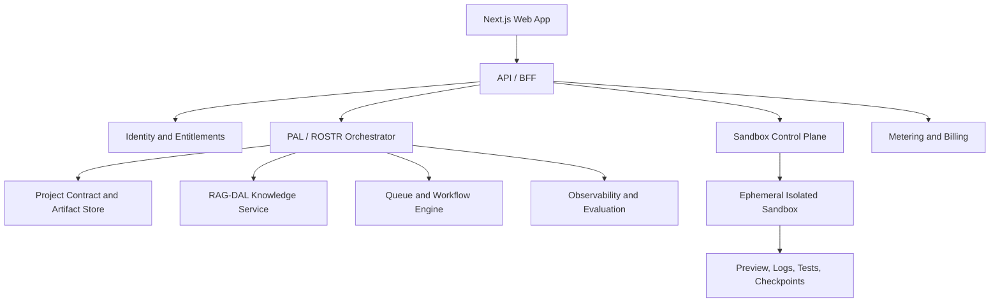

# LetsVibeAI — Growth, Revenue, and Builder Workspace Plan

**Status:** Planning baseline  
**Framework:** ROSTR PAL-integrated  
**Primary outcome:** Turn LetsVibeAI from a free course catalog into a trusted learning-and-building membership with recurring revenue, measurable learner progress, and a safe place to create real projects.

## 1. Product thesis

LetsVibeAI already teaches a clear progression: AI foundations, vibe coding, tool selection, prompt chaining, context engineering, and process engineering, plus free hands-on labs. The redesign should turn that curriculum into a **learn → build → get feedback → publish → return** loop rather than replacing it with another generic AI chat site.

**Positioning:** *The practical AI-building academy where learners turn an idea into a tested, presentable project—with structured lessons, an AI workspace, and safe project sandboxes.*

### Primary audience
- Curious non-technical builders who want to make useful websites, apps, and automations.
- Early founders, creatives, operators, and students who need a guided first build.
- Intermediate vibe coders who want more disciplined prompting, context, testing, and shipping practices.

### Product principles
- Keep foundational learning free after account creation.
- Sell **guided execution**, persistent workspaces, feedback, templates, and higher usage—not basic information alone.
- Teach responsible building: scope, source awareness, privacy, testability, and iterative delivery.
- Make every course lesson lead to an observable learner action and portfolio artifact.

## 2. Goals and measures

| Goal | Leading metric | Outcome metric |
|---|---|---|
| Grow qualified subscribers | Visitor → account conversion; email capture rate | Activated free learners per month |
| Improve activation | First lesson completed; first workspace project created | Week-1 activated learner rate |
| Create revenue | Workspace trial starts; checkout conversion | Monthly recurring revenue and paid retention |
| Improve learning value | Lab starts; project milestones completed | Portfolio projects published or shared |
| Build trust | Citation/helpfulness rating; sandbox run success | Support rate, refund rate, learner satisfaction |

Set numeric targets only after collecting a 30-day baseline; use cohort analysis by acquisition source, learner intent, and plan.

## 3. Offer and monetization

### Free: Learn and prove value
- Account-required access to the six core modules and three existing labs.
- Lesson progress, starter templates, public project gallery, limited project-plan generation.
- One short onboarding assessment and one saved project brief.
- Email learning path and milestone reminders with explicit subscription consent.

### Builder Workspace: $5/month launch hypothesis
- Persistent personal workspace with PAL project planner.
- Curriculum-aware chat that can reference the learner’s enrolled lessons and their uploaded project artifacts.
- Two active sandbox projects, starter repositories/templates, prompt history, project contract, and milestone checklist.
- Monthly usage allowance with visible limits; do not promise unlimited model use.

### Pro Builder: validate after retention signal
- More active projects and usage credits, advanced ROSTR project packs, review queues, collaboration/share links, and deployment-readiness checks.
- Price only after measuring completion, support cost, and compute use from Builder cohorts.

### One-time and B2B add-ons
- Sell focused skill/template packs: landing-page launch, e-commerce validation, local-service automation, portfolio builder, and project audit.
- Offer cohort workshops or team workspaces only after the consumer workflow is stable.

**Pricing rule:** Features that create ongoing compute or storage cost must have explicit quotas, credit metering, or a higher plan. Paid deployment, third-party account creation, and external publishing remain approval-gated.

## 4. Experience redesign

### Public site
1. **Hero:** a single outcome, “Build your first useful AI-powered project with a plan, coach, and sandbox.” Include course proof, examples, and a clear free-account CTA.
2. **Proof path:** show the six-module journey and three labs as a project ladder, not a curriculum list.
3. **Project gallery:** feature learner projects, before/after prompts, milestones, and permissioned testimonials.
4. **Workspace preview:** show a real project brief, chat guidance, files, sandbox state, and test result.
5. **Offer page:** compare Free and Builder by outcomes, workspace/project limits, and usage policy.
6. **Trust:** explain data handling, what the assistant can/cannot do, billing terms, and how sandbox isolation works.

### Authenticated learner journey

```mermaid
flowchart LR
  A[Create free account] --> B[Choose goal and skill level]
  B --> C[Recommended learning path]
  C --> D[Lesson + micro-action]
  D --> E[Create project brief]
  E --> F[PAL plan + starter kit]
  F --> G[Builder Workspace]
  G --> H[Sandbox build and tests]
  H --> I[Review, publish or share]
  I --> J[Portfolio, next project, referral]
```

### Builder Workspace information architecture
- **Home:** today’s next learning action, active projects, milestones, and usage.
- **Learn:** modules, labs, lesson notes, templates, completion evidence.
- **Projects:** a project list with status, brief, files, decision log, and share state.
- **Workspace:** chat, context drawer, project contract, artifact panel, tool activity, and approval prompts.
- **Sandbox:** preview URL, run logs, test results, version/checkpoint history, environment-variable references, and reset/clone controls.
- **Community:** optional project gallery, challenges, peer feedback, and member guidelines.

## 5. PAL-integrated workspace

The PAL Skill Builder becomes the core translation layer inside each project workspace.

| Workspace event | PAL/ROSTR behavior | Learner-visible artifact |
|---|---|---|
| Learner describes an idea | PAL extracts goal, users, constraints, unknowns, and non-goals | Project brief and open-decision list |
| Idea needs external facts | RAG-DAL plans/scopes research and returns cited evidence | Source register and knowledge pack |
| Scope is understood | JTBD maps user, system, build, and operational jobs | JTBD report and acceptance criteria |
| Tasks are known | NPAO ranks Now/Next/Later and identifies dependencies | Build playbook and milestones |
| Learner is ready to build | Instruction Architect emits harness-specific prompts, file plan, and test plan | Build prompt pack and starter repository plan |
| Code or configuration changes | Sandbox executes bounded actions and verification | Run log, test evidence, checkpoint |
| External action is requested | Approval policy pauses the flow | Approval request with scope and impact |

The workspace must never silently expand scope. PAL suggestions such as adding payments, scraping, sending email, deploying, or connecting a third-party account remain visible proposals until the learner approves them.

## 6. MVP build plan

### Now — foundation and first revenue loop
1. Preserve the existing course and labs; require sign-up for progress, saved project briefs, and email preferences.
2. Implement a refreshed public site, goal-based onboarding, learner dashboard, and course/lab progress tracking.
3. Implement the Builder Workspace with project creation, PAL brief generation, structured chat, artifact panel, and a project contract.
4. Ship an isolated sandbox MVP that supports one approved template stack, run/preview, logs, reset, checkpoint, and explicit usage limits.
5. Add the $5/month Builder checkout, entitlement enforcement, metering, cancellation, and billing support paths.
6. Instrument activation, progression, workspace usage, sandbox success, conversion, churn, and compute cost.

### Next — completion and retention loop
- Curriculum-aware retrieval with citations and lesson-source boundaries.
- Guided build challenges, project templates, and portfolio/share flows.
- Feedback/evaluation rubric for project briefs and milestone completion.
- Lifecycle messaging: unfinished lab nudge, first project milestone, sandbox failure help, and completion celebration.
- Referral loop only after learners demonstrate satisfaction and project outcomes.

### Later — expansion after evidence
- Collaborative workspaces, cohorts, mentor review, B2B/team administration, more runtime templates, deployment integrations, and marketplace skill packs.

## 7. Technical architecture

**Constraint:** AWS-only monorepo, consistent with the operating preference for this product family. Use managed services and isolated execution boundaries; do not place model credentials or user secrets in prompts, logs, or project files.

### Recommended service boundaries
- **Web/BFF:** Next.js/TypeScript for the public site and member application; server-side API boundary for authorization and entitlements.
- **Identity:** managed authentication with verified email and clear consent state.
- **Project data:** relational project records, artifact metadata, progress, entitlements, usage events, and decision logs.
- **Artifacts:** object storage for learner uploads, generated documents, sandbox logs, and checkpoints; private by default.
- **PAL runtime:** phase-aware orchestration that reads/writes the project contract and invokes tools through a policy broker.
- **Knowledge:** project-scoped RAG-DAL retrieval and source register; course content only enters answers through approved retrieval context.
- **Sandbox:** ephemeral, per-project isolated execution with resource limits, egress restrictions, signed artifact access, no long-lived production credentials, and automatic teardown.
- **Billing/metering:** entitlement checks before expensive actions; record usage before/after model or sandbox runs.
- **Observability:** event traces, cost attribution, quality/evaluation scores, error reporting, and audit logs with redaction.

## 8. Sandbox safety contract

The MVP sandbox is for learning and testing—not unrestricted infrastructure.

- Run each project in an isolated, short-lived environment with CPU, memory, disk, duration, and concurrent-run limits.
- Default to restricted network egress and deny access to internal cloud metadata endpoints.
- Issue short-lived, scoped credentials only when an approved project integration requires them.
- Store secrets in a secrets manager and expose references, never raw values, to the UI, chat transcript, PRD, or logs.
- Scan dependencies and generated files before execution; preserve logs and checkpoints for troubleshooting.
- Require explicit approval before public deployment, payment activation, external messaging, domain changes, privileged API access, or destructive database operations.

## 9. Delivery roadmap

| Milestone | Demonstrable result | Exit evidence |
|---|---|---|
| 0. Baseline | Analytics and funnel map on the current site | Event taxonomy firing; baseline dashboard available |
| 1. Brand and conversion | Redesigned public experience and free account flow | Responsive QA, signup flow, CTA tracking |
| 2. Learning loop | Dashboard, progress, goal onboarding, project brief | Test learner completes a lesson and creates a brief |
| 3. Paid workspace | Builder entitlement, PAL chat/artifacts, quota display | Checkout-to-entitlement test; project persists |
| 4. Sandbox MVP | Template project runs, previews, logs, resets | Isolation test, run test, teardown test, cost event |
| 5. Retention loop | Completion nudges, project feedback, shareable artifact | Cohort retention and project-completion review |

## 10. Measurement plan

### Core events
`landing_view`, `cta_clicked`, `account_created`, `onboarding_completed`, `module_started`, `module_completed`, `lab_started`, `project_created`, `pal_brief_generated`, `workspace_opened`, `sandbox_run_requested`, `sandbox_run_succeeded`, `sandbox_run_failed`, `checkout_started`, `subscription_activated`, `subscription_cancelled`, `project_shared`.

### Weekly review
Review activation funnel, lesson-to-project conversion, sandbox success and failure modes, paid conversion, active subscribers, usage cost per active subscriber, cancellation reason, support volume, and project completion. Use findings to change one high-confidence variable at a time.

## 11. Decisions and open questions

| Decision | Default | Why it remains open |
|---|---|---|
| Paid launch price | $5/month Builder hypothesis | Validate demand, usage, support, and infrastructure cost before commitment |
| First sandbox template | Single web-app starter template | Limits safety and support complexity |
| Initial audience | Beginner-to-intermediate individual builder | Needs confirmation from current audience and acquisition data |
| Community | Gallery/challenges before full social feed | Test value without high moderation burden |
| Deployment | Export/preview first; public deployment gated | Reduces security and external-impact risk |

## 12. Definition of done

The redesign is successful when a new learner can create an account, complete a meaningful first learning action, turn an idea into a PAL project brief, run a safe starter project in a sandbox, understand their next step, and choose a paid workspace based on clearly demonstrated value. The business side is ready to iterate when every stage is instrumented, paid usage is entitlement-gated, sandbox costs are observable, and the team has evidence about activation, retention, and willingness to pay.
